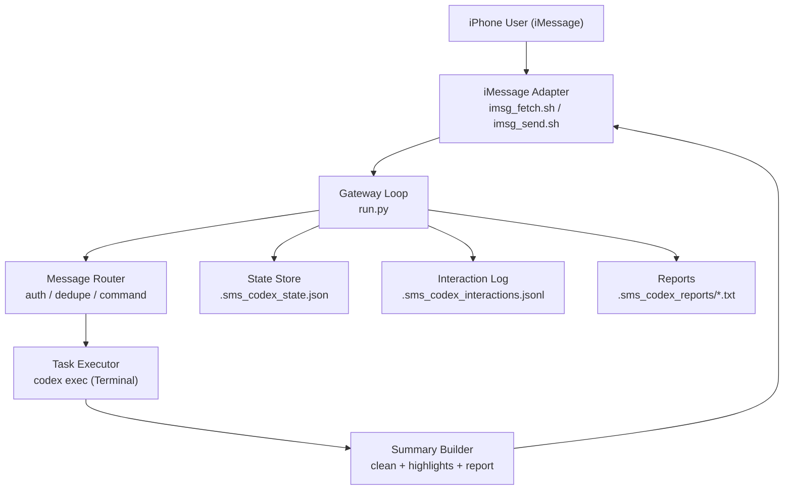

# iMessage Gateway Architecture

本项目目标：把 Codex 的终端交互入口迁移到 iMessage，让用户在手机侧完成对话、需求发布和状态查询。

## Components

- `adapters/imsg_fetch.sh`：从指定 chat 拉取消息。
- `adapters/imsg_send.sh`：发送消息回用户会话（UTF-8）。
- `run.py`：
  - 轮询消息、去重、鉴权、命令路由。
  - 执行 `codex exec` 并定期发送处理中通知。
  - 生成可读摘要与完整报告。
  - 记录交互日志，保留审计链路。

## Runtime Flow

1. 拉取消息 -> 标准化为 `{id, from, text, ts}`。
2. 过滤已处理消息；按配置决定是否仅处理最新消息。
3. 路由命令：
   - `状态` / `status` / `/status` / `进度` / `最新状态`：立即返回当前任务状态，不触发 Codex 执行。
4. 普通任务：
   - 先发送“已开始处理”确认；
   - 执行 `codex exec`；
   - 按 `PROGRESS_NOTIFY_INTERVAL_SEC` 发送处理中进度；
   - 完成后发送摘要，并落地完整报告。

## Reliability Guardrails

- 单实例锁：`LOCK_FILE`，防止多实例重复消费。
- 消息去重：`processed_ids` 持久化。
- 错误兜底：执行异常也标记消息为已处理，避免无限重试。
- 启动通知：服务重启可见。

## Identity Mapping

- 用户端标识：`REMOTE_USER_ID`（示例：`<USER_IMESSAGE_ID>`）
- 本机 UDP 端口：`LOCAL_UDP_PORT`（示例：`20098`）
- 若要真正走 UDP 传输，需新增 UDP adapter。
