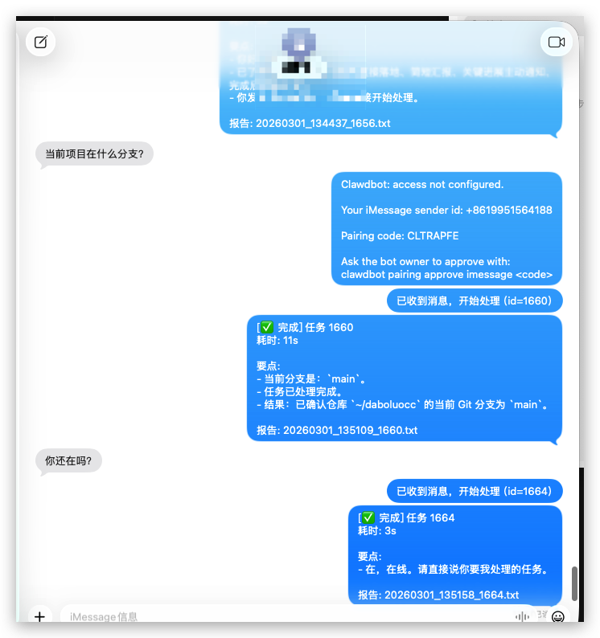
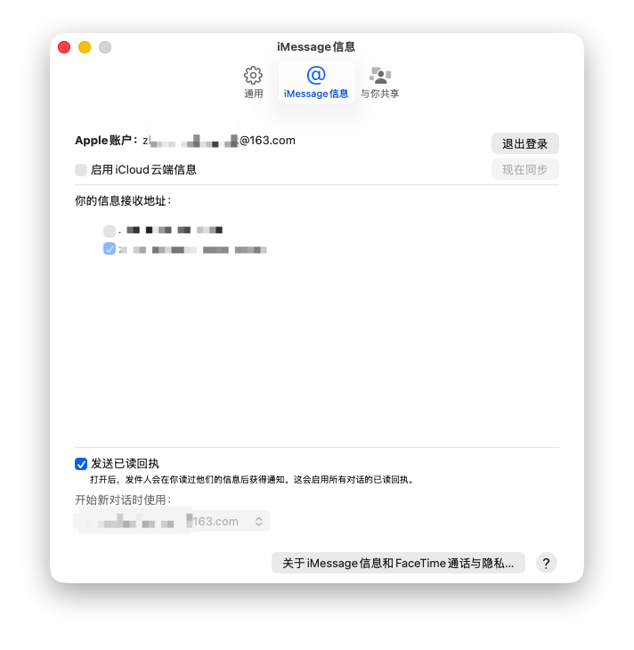

# sms-codex-loop

把 Codex 的 Terminal 交互入口迁移到 iMessage。  
你可以直接用手机给 Codex 下发任务、查看进度和拿结果，不需要坐在电脑前。

## Why

这个项目解决一个很实际的问题：
- 人不在电脑前，也能远程驱动 Codex 执行任务
- 通过 iMessage 作为统一入口，低门槛、实时、可追踪
- 保留完整交互日志，方便排查和复盘

## Features

- iMessage 入站 -> `codex exec` 执行 -> iMessage 出站回包
- 任务开始确认消息（ack）
- 任务处理中进度通知（可配置间隔）
- `状态`/`status` 命令即时查询当前任务
- 单实例锁，避免重复消费
- 交互日志 JSONL + 完整执行报告 TXT
- `.env` 集中配置，脚本自动加载

## Demo Screenshots

截图建议统一放到 `docs/screenshots/`，README 会自动渲染。





如果你已经把截图放好了但文件名不同，改成对应路径即可。

## Architecture

详见 [ARCHITECTURE.md](ARCHITECTURE.md)。

核心链路：
1. `adapters/imsg_fetch.sh` 拉取会话消息
2. `run.py` 路由消息并执行 `codex exec`
3. `adapters/imsg_send.sh` 回发结果到 iMessage
4. 落盘状态、日志、报告到本项目目录

## Quick Start

1. 从模板复制配置：
```bash
cp .env.example .env
```
2. 编辑 `.env`
2. 启动：

```bash
cd /path/to/sms-codex-loop
sh start.sh
```

3. 手机发消息到目标 iMessage 会话

新用户建议先看配置手册：  
[新用户配置手册（iMessage）](docs/NEW_USER_ONBOARDING.md)

## Config (.env)

主要配置示例：

```bash
# 执行目录（Codex 任务实际运行目录）
CODEX_WORKDIR=/path/to/your/codex-workdir

# iMessage 会话
IMSG_CHAT_ID=<CLOUDX_CHAT_ID>
IMSG_SEND_CHAT_ID=<CLOUDX_CHAT_ID>
REMOTE_USER_ID=<USER_IMESSAGE_ID>
LOCAL_UDP_PORT=20098

# 轮询与执行
POLL_INTERVAL_SEC=5
CODEX_TIMEOUT_SEC=1800
PROCESS_ONLY_LATEST=1

# 回复格式
SMS_REPLY_MAX_CHARS=8000
SMS_HIGHLIGHT_MAX_LINES=20
PROGRESS_NOTIFY_INTERVAL_SEC=60
```

## Runtime Files

默认都在当前项目目录（不会落到目标项目）：

- `.sms_codex_state.json`
- `.sms_codex_interactions.jsonl`
- `.sms_codex_loop.lock`
- `.sms_codex_reports/*.txt`

## Known Pitfalls (踩坑记录)

1. iMessage 会话发错线程（手机号线程 vs 邮箱线程）
- 现象：手机显示“已发送”，但网关收不到
- 原因：监听的是一个 chat id，但你发到了另一个会话线程
- 处理：确认发消息的会话和监听会话一致

2. macOS/iPhone 同步导致“自己发给自己”混淆
- 现象：Mac 上出现 `is_from_me=true` 的消息，看起来像收到了新消息
- 原因：Continuity/iMessage 同步把手机发出的消息同步到 Mac
- 处理：在系统设置里关闭不需要的同步/接力，或严格按指定会话测试

3. 多机器人同时在线抢回复（如 OpenClaw/Clawbot）
- 现象：同一个会话里出现别的 bot 回包
- 原因：机器上有其他 gateway 进程在跑
- 处理：停掉不需要的进程，只保留一个服务实例

4. `.env` 命令值未加引号导致异常执行
- 现象：启动时报奇怪 shell 错误（例如 fork 相关）
- 原因：`SMS_FETCH_CMD`/`SMS_SEND_CMD` 有空格但未用引号
- 处理：在 `.env` 里对命令字符串加双引号

5. 多实例导致重复执行
- 现象：同一消息多次回复
- 原因：服务被重复启动
- 处理：使用单实例锁，避免多个 loop 并行运行

6. “只处理最新一条”导致中间消息被跳过
- 现象：连续发多条只处理最后一条
- 原因：`PROCESS_ONLY_LATEST=1`
- 处理：改为 `PROCESS_ONLY_LATEST=0` 处理完整队列

## Logging & Observability

- 控制台日志会打印：
  - 收到的用户指令
  - 开始处理标记
  - 调用发送脚本的命令内容
- 交互日志 `.sms_codex_interactions.jsonl` 会记录：
  - inbound / outbound / skip / exec / error 全链路事件

## Security Notes

- 建议使用独立测试 Apple ID 或独立会话
- 不要把敏感路径、token、私密内容直接写进公开截图
- 开源前建议清理 `.sms_codex_reports` 与历史日志

## Development

本地快速检查：

```bash
bash -n adapters/imsg_fetch.sh
bash -n adapters/imsg_send.sh
bash -n adapters/imsg_notify.sh
python3 -m py_compile run.py
```

## Roadmap

- 支持多会话白名单路由（可选）
- Web 控制台查看任务队列和日志
- 可插拔消息通道（Telegram/WhatsApp/Slack）
- 更细粒度的任务状态机与重试策略

## License

MIT (建议)
