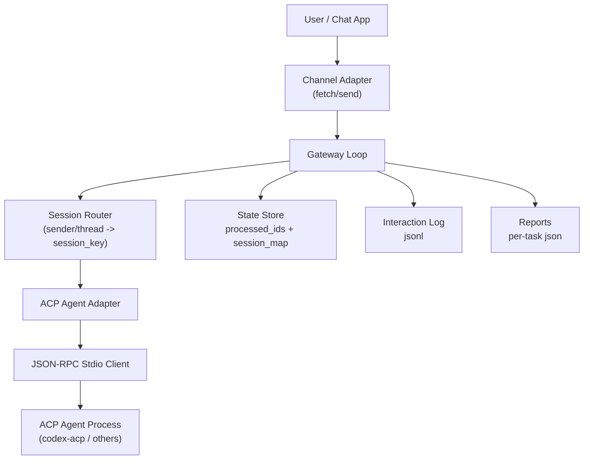

# Architecture (ACP-first)

## Runtime sequence

1. Channel fetch 返回标准消息。
2. Loop 去重 + allowlist 鉴权。
3. Router 生成稳定 `session_key`，读取/写回 `session_id` 映射。
4. Agent Adapter 执行 ACP 调用：
   - `initialize`
   - `session/new`（无 session 时）
   - `session/prompt`
5. 循环处理 ACP 的 `session/update` 与 `session/request_permission`。
6. 终态后构建摘要，发送到 channel，并落地报告。

## 设计原则

- 渠道与 agent 解耦。
- 执行层协议化（ACP），不再依赖 `<cmd> <payload>` 一次性调用。
- 会话可恢复：`session_map` 持久化。
- 失败可追踪：interaction log + report。
