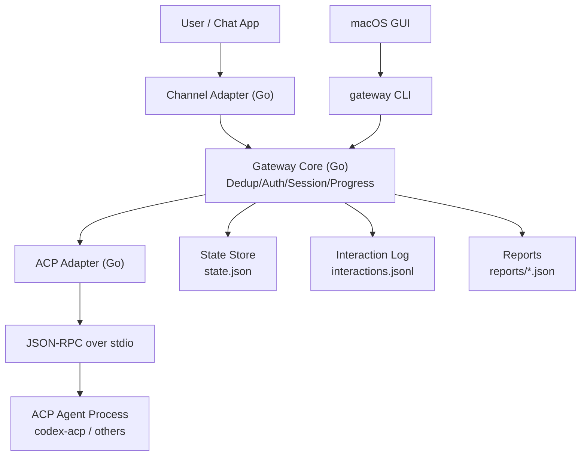

# Architecture (Go-first / ACP-first)

## vNext 架构定位

新版本采用 **Go 作为唯一网关后端运行时**，不再以 Python 兼容为目标。

- 网关服务：Go 实现（ACP Gateway）
- 运维入口：CLI（配置、控制、状态、诊断、发送）
- 桌面入口：macOS GUI（通过 CLI 管理网关）
- 执行协议：ACP（JSON-RPC over stdio）

## 运行链路（vNext）

1. Channel adapter 接收消息并规范化。
2. Gateway core 执行去重、鉴权、会话路由。
3. ACP adapter 发起 `initialize/session/new/session/prompt`。
4. 循环处理 `session/update` 与 `session/request_permission`。
5. Gateway 生成最终回复并通过 channel 发送。
6. 写入状态、交互日志、任务报告供 CLI/GUI 查询。

## 组件职责

- `gatewayd`（Go 服务进程）
  - 核心编排与 ACP 执行
  - 通道接入与回复发送
  - 状态与日志持久化
- `gateway`（Go CLI）
  - `start/stop/restart/status`
  - `send`（本地会话发消息）
  - `config get/set/validate`
  - `doctor`（依赖与环境检查）
- `macOS GUI`
  - 只通过 CLI 做管理与发送
  - 不直接实现网关业务逻辑

## 关键设计原则

- 单一后端实现：Go-first，不维护双栈兼容。
- 协议边界稳定：ACP 是唯一 agent 执行边界。
- 控制面与数据面分离：GUI 走 CLI，CLI 控制 gatewayd。
- 可观测优先：状态/日志/报告保持机器可读。
