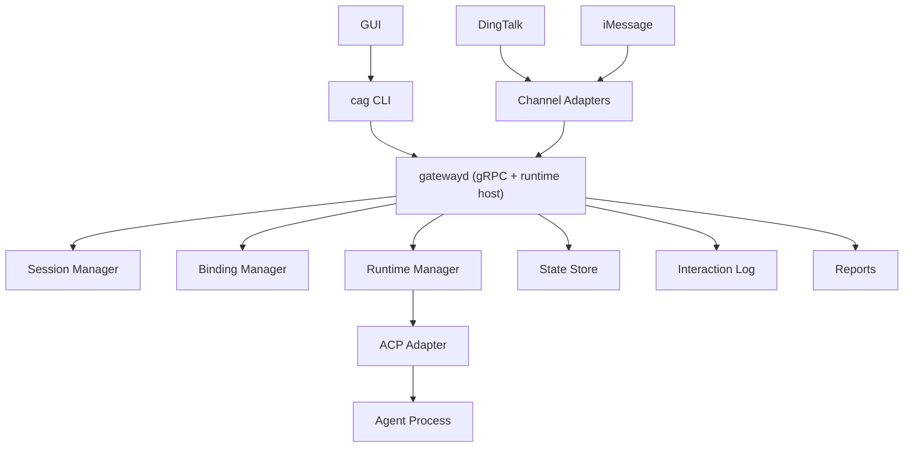

# Architecture (Session-First vNext)

This document defines the new product model for `cli-agent-gateway`.

## Goal

The product is optimized for one person working on the same local task from multiple entrypoints.

Example:

- On desktop: talk through the macOS GUI.
- On phone: talk through DingTalk.
- Both entrypoints attach to the same task session.
- The gateway routes both to the same live task context.

## Core Principles

- `session` is the only context owner.
- `channel` is only an ingress/egress endpoint.
- `binding` is explicit.
- `runtime` is long-lived per session.
- control-plane config and runtime state live under `~/.cag`.
- `session.workdir` is the only task working directory concept.
- No routing by heuristic derivation.
- No implicit write routing to `latest`.

## Canonical Model

### Session

A session represents one real task context.

It owns:

- `session_key`
- `workdir`
- message history
- timeline/events
- runtime lifecycle
- live ACP context

### Channel Conversation

A channel conversation represents one concrete external conversation endpoint.

Examples:

- GUI local input stream
- one DingTalk DM conversation
- one iMessage conversation

### Binding

A binding explicitly maps one channel conversation to one session.

Without a binding:

- the conversation is visible
- the message may be recorded
- but the message must not execute

### Runtime

Runtime is the live ACP/agent process attached to a session.

`gatewayd` hosts the runtime manager together with the external gRPC/control-plane surface.

They are one integrated daemon, not two peer top-level services.

Runtime is not the user-facing session identity.

Gateway startup must fail fast when the configured ACP agent command is not available on PATH.

## System Shape

```mermaid
flowchart TD
    GUI["GUI"] --> CLI
    DT["DingTalk"] --> CH
    IM["iMessage"] --> CH
    CLI["cag CLI"] --> GD["gatewayd (gRPC + runtime host)"]
    CH["Channel Adapters"] --> GD
    GD --> SM["Session Manager"]
    GD --> BM["Binding Manager"]
    GD --> RM["Runtime Manager"]
    RM --> ACP["ACP Adapter"]
    ACP --> AG["Agent Process"]
    GD --> ST["State Store"]
    GD --> IL["Interaction Log"]
    GD --> RP["Reports"]
```

## Routing Rules

### GUI Writes

- GUI always targets one explicit selected session.
- GUI does not write to `latest` implicitly.
- `latest` exists only for UI default selection.

### Channel Ingress

- If the incoming conversation has a binding, route to that bound session.
- If the incoming conversation has no binding, do not execute.
- Put the conversation into an unassigned inbox for GUI/CLI management.

### Explicit Non-Goals

The gateway must not:

- derive sessions from `channel + sender + thread`
- implicitly reopen or fork sessions
- silently recover by creating a new session when routing is ambiguous
- treat channel identity as task context identity

## Runtime Ownership

To support real shared context across GUI and phone entrypoints:

- one session may have one live runtime
- multiple entrypoints may write into that same session
- the runtime must survive across sends until explicitly detached, stopped, cleared, or deleted
- runtime restart must be explicit for a target session; no hidden restart/fork behavior

This is the key change from the old stateless-per-send model.

## Data Responsibilities

- `channel adapters`
  - normalize ingress/egress data
- `session manager`
  - create, delete, clear, inspect sessions
- `binding manager`
  - create, delete, inspect bindings
- `runtime manager`
  - attach, detach, inspect live session runtimes
- `ACP adapter`
  - talks ACP only
- `storage`
  - persists sessions, bindings, interactions, reports

## Control-Plane Home

- `gatewayd` is user-scoped, not repo-scoped.
- Runtime state, logs, SQLite, and operator config live under `~/.cag/`.
- Managed `gatewayd` state is recorded in one global file under `~/.cag/gatewayd/`; it must not fork by repo.
- Control-plane RPCs must not accept per-request `repo_root` overrides.
- Relative session workdirs should be normalized in the CLI before the request is sent.

## Observability

The system should expose:

- session list
- session detail
- session messages
- runtime list
- binding list
- unassigned channel inbox
- machine-readable logs and reports

## Command Families

The product command tree should converge to:

- `cag session ...`
- `cag channel ...`
- `cag binding ...`
- `cag runtime ...`
- `cag config`

Old flat commands are legacy and should not receive new behavior.

Migration-only control-plane commands may still exist, but they should be hidden from the primary help surface and treated as internal operator entrypoints.

## Design Constraints

- doc-first changes
- explicit routing only
- grouped command families only
- failure must be clear and actionable
- remove obsolete compatibility paths rather than stacking new ones
