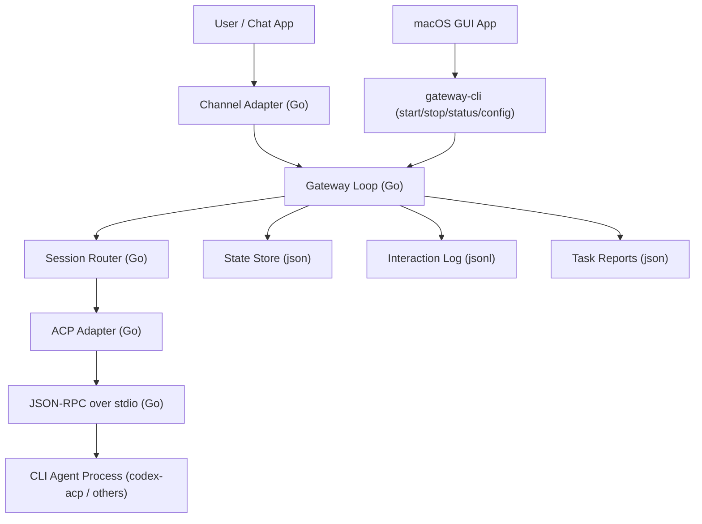

# Go Backend Architecture Proposal

This document describes the target architecture for running `cli-agent-gateway` as a cross-platform Go backend service, while keeping the macOS app as a UI/controller layer.

## Decision

Use **Go** for the gateway backend service.

Rationale:
- Better cross-platform distribution via single binary.
- Good fit for long-running process + concurrent channel/agent I/O.
- Easier deployment for Linux/macOS/Windows environments.
- Keep ACP-first protocol boundary unchanged to preserve current behavior and agent compatibility.

## Target architecture



## Component boundaries

- `channels/`: ingress/egress implementations for iMessage, DingTalk, command mode, and future channels.
- `core/`: message dedup, auth/allowlist, session routing, progress replies, and task lifecycle.
- `agents/`: ACP protocol adapter only (initialize/session/new/session/prompt, updates, permissions).
- `infra/`: process lock, config/env loading, JSON state, logs/reports, retries/timeouts.
- `cmd/gateway-cli`: executable entrypoint and operational commands (`run`, `status`, `config`).

## macOS app integration

The macOS app should not embed gateway business logic. It should:
- Launch/stop/restart `gateway-cli`.
- Read status/health/log files from defined paths.
- Edit `.env` (or config file) via a controlled config flow.
- Display sessions/interactions based on machine-readable outputs (`state.json`, `interactions.jsonl`, reports).

This keeps UI and backend independently releasable.

## Compatibility contract

To minimize migration risk, keep these contracts stable:
- Existing env keys in `.env.example` (or provide migration aliases).
- State/report file schemas used by macOS app and tooling.
- ACP message handling semantics and timeout/retry behavior.
- Channel message normalization format (`id/from/text/ts/thread_id` + metadata).

## Migration plan (staged)

1. `infra` port
- Process lock semantics (`.cli_agent_gateway.lock`).
- Config loader and defaults.
- JSON state/log/report persistence.

2. `agents` port
- JSON-RPC stdio client.
- ACP adapter and event loop behavior.

3. `core` port
- Main loop: dedup, allowlist, session map, progress notifications.
- Preserve special commands like `/new`, `/clear`.

4. `channels` port
- Command channel first (lowest risk).
- DingTalk and iMessage adapters next.

5. Shadow validation
- Run Go gateway alongside Python on mirrored input.
- Compare summaries, states, and reports.

6. Cutover
- Make Go gateway default runtime.
- Keep Python implementation as temporary fallback during stabilization.

## Risks and mitigations

- Behavior drift in `core` logic:
  - Mitigation: golden tests from captured real interaction logs.
- Channel-specific edge cases:
  - Mitigation: adapter-level integration tests with mock scripts.
- Backward compatibility breaks in config/state:
  - Mitigation: schema/version checks and migration helpers.

## Suggested repository structure for Go implementation

```text
cmd/gateway-cli/main.go
internal/core/
internal/agents/
internal/channels/
internal/infra/
docs/
```

Keep docs, scripts, and macOS app in this repository. If needed, keep Python and Go runtimes side-by-side during migration.
