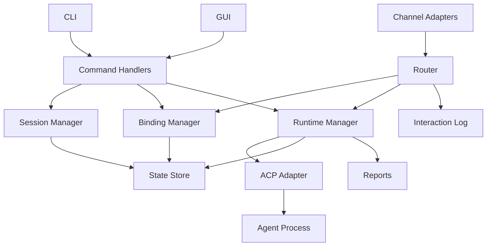

# Go Backend Architecture (Session Manager / Binding Manager / Runtime Manager)

This document describes the backend design that supports the new session-first product model.

## Objective

Support one user working on the same task session from multiple entrypoints while preserving one shared live task context.

## New Backend Managers

### Session Manager

Responsibilities:

- create sessions
- delete sessions
- clear session context
- load session metadata
- expose session list and session detail

Owns:

- `session_key`
- `workdir`
- session status
- created/updated timestamps

### Binding Manager

Responsibilities:

- bind a channel conversation to a session
- unbind a channel conversation
- list bindings
- expose unassigned conversations

Owns:

- `channel`
- `conversation_id`
- optional `thread_id`
- target `session_key`

### Runtime Manager

Responsibilities:

- attach live ACP runtime to a session
- detach runtime from a session
- keep runtime registry
- serialize writes into one session runtime
- expose runtime status and process list

Owns:

- live runtime handle
- process/session health
- current attached ACP session identity as internal-only data

## Internal Rule

User-facing `session` identity and internal ACP session identity must be treated as different things.

- `session_key` is stable product identity
- ACP `session_id` is runtime-private implementation detail

ACP `session_id` should not define routing semantics.

## Suggested Backend Shape


```mermaid
flowchart TD
    CLI["CLI"] --> API["Command Handlers"]
    GUI["GUI"] --> API
    CH["Channel Adapters"] --> RT["Router"]
    API --> SM["Session Manager"]
    API --> BM["Binding Manager"]
    API --> RM["Runtime Manager"]
    RT --> BM
    RT --> RM
    RM --> ACP["ACP Adapter"]
    ACP --> AG["Agent Process"]
    SM --> ST["State Store"]
    BM --> ST
    RM --> ST
    RT --> IL["Interaction Log"]
    RM --> RP["Reports"]
```

## Ingress Flow

### GUI Send

1. GUI selects one explicit session.
2. GUI calls `session send`.
3. Runtime manager finds or creates the live runtime for that session.
4. Message is delivered into that session runtime.

### Channel Ingress

1. Channel adapter normalizes incoming conversation identity.
2. Router asks binding manager for a binding.
3. If binding exists:
   - send to that bound session runtime
4. If binding does not exist:
   - record as unassigned
   - do not execute

## Runtime Policy

For each session:

- at most one attached runtime
- ordered writes into that runtime
- explicit attach/detach lifecycle

Allowed transitions:

- `created -> attached`
- `attached -> detached`
- `attached -> cleared`
- `attached -> deleted`
- `detached -> attached`

## Storage Model Preview

Suggested persisted structure:

```json
{
  "sessions": {},
  "bindings": {},
  "runtime_index": {},
  "unassigned_conversations": []
}
```

Suggested split:

- `sessions`
  - durable product objects
- `bindings`
  - durable routing map
- `runtime_index`
  - operational runtime metadata
- `unassigned_conversations`
  - actionable routing inbox

## Migration Principle

The old behavior used:

- flat session commands
- heuristic routing
- stateless send execution

The new behavior must converge to:

- grouped commands
- explicit binding
- long-lived runtime per session

Do not preserve both models indefinitely.

## Testing Priorities

1. same session receives GUI and DingTalk messages in order
2. unbound channel conversations do not execute
3. deleting a session tears down bindings and runtime
4. clearing a session resets live context but preserves session identity
5. attach/detach is explicit and observable
